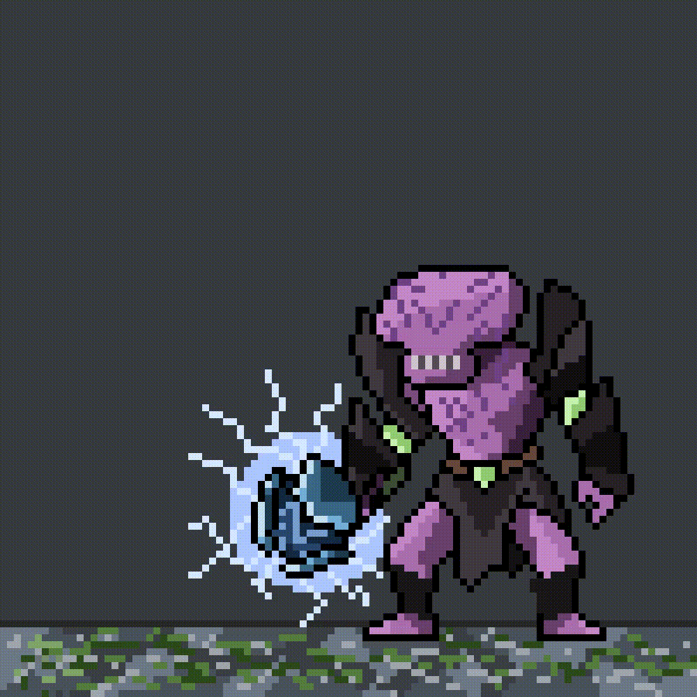

<!-- README Generated via readme.js. If you're reading this raw, congrats. You're early. -->


```
(c).-.(c)        System.OS     : A black-box dev environment where code is crafted first, polished later. Built on silent documentation dives, dockerized dreams, and dark mode discipline.
( ⚆ _ ⚆ )            System.Uptime : 23 years, 2 months, 28 days old
 / (_) \             Location      : Kathmandu, Nepal
/_/   \_\            Status        : Grooving in Full Stack Flow™

Technologia Stack
  • Languages         : C#, TypeScript, Python, JavaScript
  • Frameworks        : .NET, React, Blazor, Django
  • Tools             : Docker, GitHub Actions, Hangfire, Firebase, Stripe
  • DB Love           : PostgreSQL, SQL Server, Redis
  • Other Skills      : CI/CD, API Development, Third-Party Integrations

GitHub Stats
  • Public Repositories : 21
  • Stars Collected     : 4
  • Followers           : 57
  • Lines of Code       : 3.1M++ (and counting...)

Currently Cooking
  • A fully dockerized dream that works on *your* machine too.
  • CI/CD pipelines that don’t randomly break at 2AM.
  • An API so clean it passes Lint with compliments.
  • C# and JS logic that doesn't bite on Fridays.
  • UIs I don’t want to gouge my eyes over (rarely).

Core Philosophy
  "Given proper time, a running laptop (preferably a Mac), and Stack Overflow,
   I can do anything."
```

---

### Faceless Void Mode

When I'm not freezing bugs in time, I'm probably freezing teamfights.


